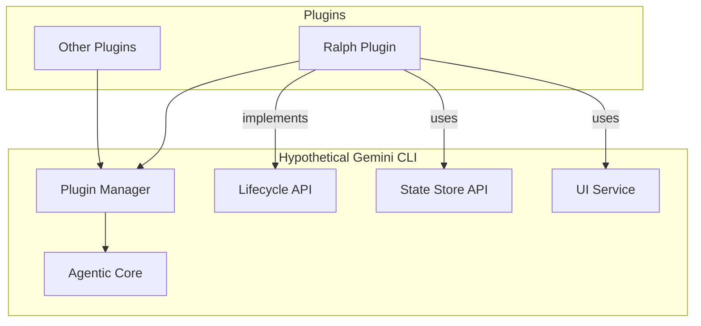
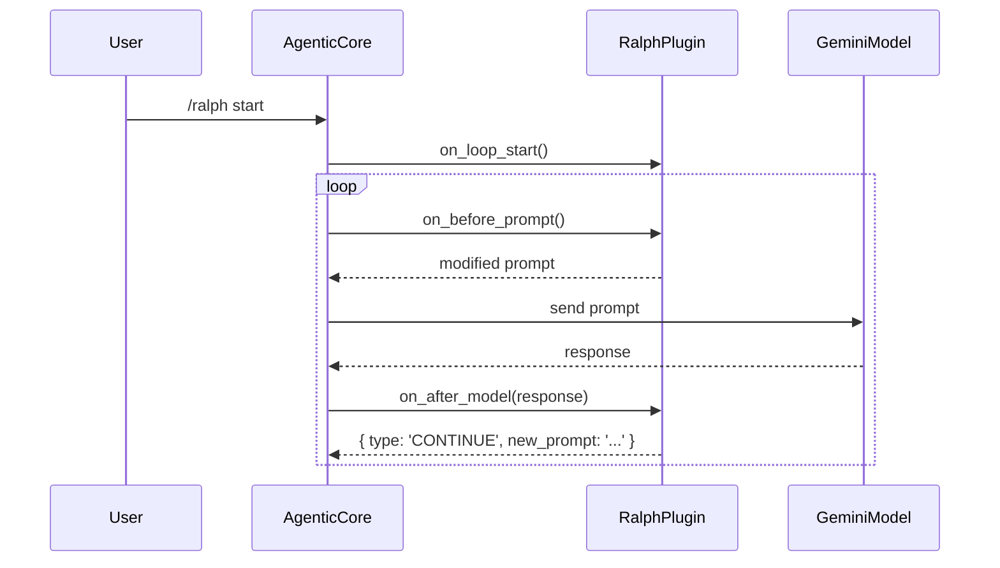

# Analysis of a Hypothetical Gemini CLI for Autonomous Agents

## 1. Introduction

This document outlines a vision for a hypothetical, next-generation Gemini CLI designed with first-class support for autonomous agent plugins like Ralph. It addresses the challenges identified in the analysis of the existing Gemini CLI and proposes an architecture that is fundamentally oriented around extensibility and long-running, agentic processes.

## 2. Core Architectural Goals

The primary goal is to create a CLI that is not just a REPL (Read-Eval-Print Loop) with hooks, but a true "agent runner."

-   **First-Class Autonomous Agents:** The CLI's core logic should be an "agentic loop" that is explicitly designed to be driven by plugins.
-   **Deep Integration:** Plugins should be able to do more than just react to events; they should be able to actively control the flow of the agentic loop.
-   **Built-in State Management:** The CLI should provide a robust and easy-to-use mechanism for plugins to manage their state.
-   **Extensible User Interface:** Plugins should be able to contribute their own UI components to the main CLI interface.

## 3. Proposed Architecture

This hypothetical CLI would be built around a central **Agentic Core** and a set of well-defined APIs for plugins to interact with.



### 3.1. Agentic Core

Instead of a simple REPL, the core of the CLI would be a state machine that manages the lifecycle of an agent. It would be responsible for orchestrating the interactions between the user, the model, and the plugins, but the plugins would define the *behavior* of the agent.

### 3.2. Plugin Manager

The Plugin Manager would be responsible for loading, unloading, and managing the lifecycle of plugins. It would ensure that plugins are isolated and that they adhere to the defined APIs.

### 3.3. Lifecycle API

This is the most critical component for enabling autonomous agents. Plugins would implement a `Lifecycle` interface, which would give them direct control over the agentic loop.

**Proposed Lifecycle Methods:**

-   `on_loop_start(context)`: Called when the autonomous loop is initiated. The plugin would perform its setup here.
-   `on_before_prompt(context)`: Called before a prompt is sent to the model. The plugin can modify the prompt or add context.
-   `on_after_model(context, response)`: Called after the model returns a response. This is the heart of the autonomous loop. The plugin would analyze the response and return an `action` object to the Agentic Core, which could be:
    -   `{ type: 'CONTINUE', new_prompt: '...' }`: Continue the loop with a new prompt.
    -   `{ type: 'PAUSE', message: '...' }`: Pause the loop and wait for user input.
    -   `{ type: 'TERMINATE', reason: '...' }`: Terminate the loop.
-   `on_loop_end(context)`: Called when the loop terminates. The plugin would perform its cleanup here.

### 3.4. State Store API

The CLI would provide a simple, built-in key-value store that plugins can use to persist their state. This would eliminate the need for plugins to manage their own state files.

```
// Example of how a plugin would use the State Store API
const loopCount = context.state.get('ralph.loopCount', 0);
context.state.set('ralph.loopCount', loopCount + 1);
```

### 3.5. UI Service

To support monitoring, the CLI would have an extensible UI based on a terminal UI library (like `blessed` or `tui-rs`). Plugins could register their own UI "widgets" or "panes" with the UI Service.

```
// Example of how a plugin would register a UI widget
context.ui.registerWidget('Ralph Monitor', {
  render: (state) => {
    const loopCount = state.get('ralph.loopCount', 0);
    return `Loop: ${loopCount}`;
  }
});
```

## 4. How the Ralph Plugin Would Work

With this architecture, implementing the Ralph plugin would be much more straightforward and elegant.

1.  The user would run `/ralph start`.
2.  The Agentic Core would call the Ralph plugin's `on_loop_start` method.
3.  The plugin would use the `StateStoreAPI` to initialize its state (rate limiter, circuit breaker, etc.).
4.  It would use the `UIService` to register its monitoring widget.
5.  The `on_after_model` method would contain the core logic: analyze the response, update the state, and return a `CONTINUE` or `TERMINATE` action. This directly solves the "programmatic re-prompting" challenge.

### Sequence Diagram of the Hypothetical Ralph Plugin



## 5. Conclusion

A hypothetical Gemini CLI designed with a first-class agentic loop and deep plugin integration would be a far more powerful platform for building autonomous agents like Ralph. This architecture would provide a more robust, elegant, and user-friendly experience for both plugin developers and end-users, overcoming the limitations of the existing hook-based system.
