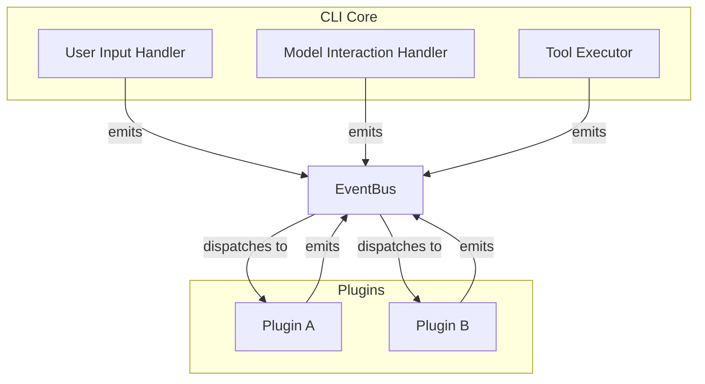

# Plugin Architecture Proposal: Event-Driven System

## 1. Introduction

This document proposes an event-driven plugin architecture for a Gemini CLI. This model is more advanced than a simple hook-based system and is inspired by event-driven architectures common in modern software development. The core principle is that the CLI emits events, and plugins are listeners that can react to these events and, in turn, emit their own events.

## 2. Core Concepts

-   **Event Bus:** A central event bus is the backbone of the CLI. All major actions (user input, model responses, tool calls) are announced as events on this bus.
-   **Events:** Events are data packets that contain information about what has happened (e.g., `user.prompt.received`, `model.response.success`).
-   **Listeners:** Plugins are collections of listeners that subscribe to specific events. When an event they are subscribed to is emitted, their code is executed.
-   **Emitters:** Plugins can also be event emitters, meaning they can put new events onto the bus, which can trigger other plugins or the CLI's core logic.

## 3. Architecture Diagram



## 4. Detailed Implementation

### 4.1. Event Bus

The CLI would be built around a robust, in-process event bus library (e.g., `EventEmitter2` in Node.js).

### 4.2. Events

The events would be more granular than in a hook-based system.

-   `user.prompt.received`: When the user enters a prompt.
-   `agent.prompt.before_send`: Before a prompt is sent to the model.
-   `model.response.success`: On a successful model response.
-   `model.response.error`: On an error from the model.
-   `tool.execution.before`: Before a tool is called.
-   `tool.execution.after`: After a tool is called.

### 4.3. Creating an Autonomous Loop

An autonomous loop would be created by a plugin that listens for the `model.response.success` event and, in response, emits a new `agent.prompt.before_send` event.

```javascript
// Example of a Ralph plugin in an event-driven system
class RalphPlugin {
  constructor(eventBus) {
    this.eventBus = eventBus;
    this.isRunning = false;

    this.eventBus.on('command.ralph.start', () => this.start());
    this.eventBus.on('model.response.success', (response) => this.onModelResponse(response));
  }

  start() {
    this.isRunning = true;
    this.eventBus.emit('agent.prompt.before_send', { prompt: 'First prompt...' });
  }

  onModelResponse(response) {
    if (!this.isRunning) return;

    const analysis = this.analyze(response);
    if (analysis.isComplete) {
      this.isRunning = false;
      this.eventBus.emit('ui.print', { message: 'Ralph has finished.' });
    } else {
      this.eventBus.emit('agent.prompt.before_send', { prompt: analysis.nextPrompt });
    }
  }

  analyze(response) {
    // ... Ralph's analysis logic
  }
}
```

## 5. Pros and Cons

### 5.1. Pros

-   **Highly Decoupled:** Plugins are completely decoupled from each other and from the core. They only need to know about the events, not about who is emitting or listening to them.
-   **Extensible:** It's very easy to add new events and new listeners, making the system highly extensible.
-   **Complex Workflows:** This architecture naturally supports complex, asynchronous workflows, as different plugins can react to and build upon each other's events.

### 5.2. Cons

-   **Complexity:** This is a more complex architecture to implement and to understand for plugin developers.
-   **Debugging:** Tracing the flow of events through the system can be challenging, making debugging more difficult. "Action at a distance" can be a problem.
-   **No Guaranteed Order:** Unless the event bus is specifically designed to support it, there is no guaranteed order of execution for listeners on the same event.

## 6. Conclusion

An event-driven architecture is a powerful and flexible way to build a highly extensible Gemini CLI. It is particularly well-suited for complex plugins and for creating an ecosystem where plugins can interact with each other. However, the increased complexity means that it may have a steeper learning curve for plugin developers compared to a simpler, hook-based system.
