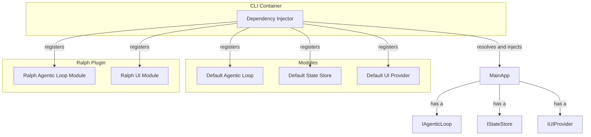

# Plugin Architecture Proposal: Modular System

## 1. Introduction

This document proposes a modular plugin architecture for a Gemini CLI. This is the most deeply integrated of the three proposed architectures. The core principle is that the CLI itself is a lightweight container, and most of its functionality, including the core agentic loop, is implemented as a set of swappable, composable modules. Plugins are, in effect, first-class modules that can replace or extend the default modules.

## 2. Core Concepts

-   **Module Container:** The CLI is a container that uses dependency injection to wire together a set of modules.
-   **Modules:** Modules are classes or objects that implement a specific, well-defined interface (e.g., `IAgenticLoop`, `IStateStore`, `IUIProvider`).
-   **Default Modules:** The CLI ships with a set of default modules that provide the standard REPL-based experience.
-   **Plugin Modules:** Plugins are third-party modules that can be registered with the container. They can either provide new functionalities or replace the default modules.

## 3. Architecture Diagram



## 4. Detailed Implementation

### 4.1. Interfaces

The architecture would be defined by a set of TypeScript interfaces.

```typescript
interface IAgenticLoop {
  start(context: IContext): Promise<void>;
}

interface IStateStore {
  get(key: string, defaultValue: any): any;
  set(key:string, value: any): void;
}

interface IUIProvider {
  render(state: IStateStore): void;
  printMessage(message: string): void;
}

interface IContext {
  state: IStateStore;
  ui: IUIProvider;
  model: IModelService;
}
```

### 4.2. Default REPL Implementation

The default `IAgenticLoop` module would implement the standard REPL behavior.

```typescript
class ReplLoop implements IAgenticLoop {
  async start(context: IContext) {
    while (true) {
      const userInput = await context.ui.prompt();
      const response = await context.model.prompt(userInput);
      context.ui.printMessage(response);
    }
  }
}
```

### 4.3. Ralph Plugin Implementation

The Ralph plugin would provide its own implementation of `IAgenticLoop`.

```typescript
class RalphLoop implements IAgenticLoop {
  async start(context: IContext) {
    let currentPrompt = 'Initial prompt...';
    while (true) {
      const response = await context.model.prompt(currentPrompt);
      const analysis = this.analyze(response);

      if (analysis.isComplete) {
        context.ui.printMessage('Ralph has finished.');
        break;
      } else {
        currentPrompt = analysis.nextPrompt;
      }
    }
  }

  analyze(response: string): { isComplete: boolean, nextPrompt: string } {
    // ... Ralph's analysis logic
  }
}
```

When the user runs `/ralph start`, the CLI would instruct the dependency injector to swap the default `IAgenticLoop` implementation with the `RalphLoop`.

## 5. Pros and Cons

### 5.1. Pros

-   **Maximum Power and Flexibility:** This architecture provides the highest degree of control to plugins. A plugin can fundamentally change the behavior of the CLI by replacing core modules.
-   **Clear Contracts:** The use of interfaces creates very clear contracts between the CLI and its plugins.
-   **Testability:** The use of dependency injection makes the CLI and its plugins highly testable.

### 5.2. Cons

-   **High Complexity:** This is the most complex architecture to design and implement.
-   **Steep Learning Curve:** Plugin developers would need to have a deep understanding of the CLI's internal architecture and concepts like dependency injection.
-   **"God" Plugins:** A poorly written plugin could completely break the CLI by providing a faulty implementation of a core module.

## 6. Conclusion

A modular, dependency-injection-based architecture is the most powerful and flexible option for a Gemini CLI. It would provide an unparalleled level of control to plugin developers and would be the ideal foundation for building sophisticated autonomous agents like Ralph. However, this power comes at the cost of increased complexity, both for the CLI's maintainers and for the plugin developers.
