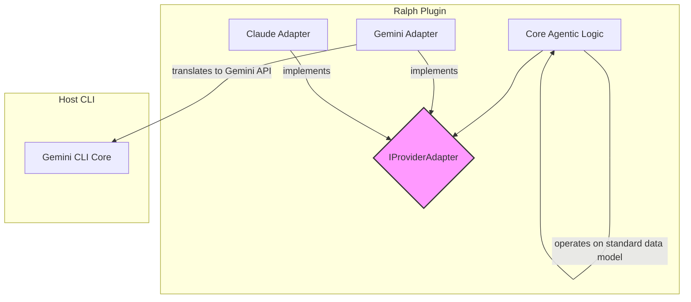

# Provider Agnosticism Strategy: Plugin-Centric Design

## 1. Introduction

This document proposes a strategy for achieving provider agnosticism (e.g., compatibility with both Gemini and Claude) where the responsibility for managing compatibility lies entirely within the plugin itself. This "plugin-centric" approach is a practical way to create a portable plugin, even when the host CLI only has native support for a single AI provider.

## 2. Core Concept: The Provider Adapter

The core of this design is the **Provider Adapter** pattern. The plugin's core logic would be written to a generic, internal data model for prompts, responses, and tool calls. It would then have a set of "adapters"—one for each supported AI provider—that are responsible for translating between the plugin's internal data model and the provider-specific API.

When the plugin is initialized, it would detect which AI provider the host CLI is using and load the appropriate adapter.

## 3. Architecture Diagram


As the diagram shows, the plugin's core logic only interacts with the `IProviderAdapter` interface. The specific adapter (e.g., `GeminiAdapter`) is responsible for the final communication with the host CLI's underlying AI provider.

## 4. Detailed Implementation

### 4.1. Standardized Data Models

The plugin would define a set of internal, provider-agnostic data models.

```typescript
// Example of a standardized message format
interface StandardMessage {
  role: 'user' | 'assistant' | 'tool';
  content: string;
}

// Example of a standardized response format
interface StandardResponse {
  content: string;
  tool_calls?: { name: string; args: any }[];
}
```

### 4.2. Adapter Interface

An interface would define the contract that all provider adapters must adhere to.

```typescript
interface IProviderAdapter {
  prompt(messages: StandardMessage[]): Promise<StandardResponse>;
}
```

### 4.3. Provider Detection

The plugin would need a mechanism to detect which provider is active. This could be done by:
-   Checking for the existence of a specific CLI command (e.g., `gemini --version`).
-   Looking for environment variables (e.g., `GEMINI_API_KEY` vs. `ANTHROPIC_API_KEY`).
-   Allowing the user to manually configure the provider in the plugin's settings.

## 5. Pros and Cons

### 5.1. Pros

-   **Self-Contained:** The plugin is completely self-contained and does not depend on the host CLI to provide any abstraction. This makes it highly portable.
-   **Full Control:** The plugin developer has full control over how to handle the nuances and unique features of each AI provider.
-   **Flexibility:** This approach can be used to add support for a provider that the host CLI does not natively support.

### 5.2. Cons

-   **High Burden on Developer:** The responsibility for implementing and maintaining the adapters for all supported providers falls on the plugin developer.
-   **Code Duplication:** If multiple plugins in the ecosystem want to be provider-agnostic, they will each have to re-implement this same adapter logic.
-   **Potential for Inconsistency:** Different plugins might implement their adapters in slightly different ways, leading to an inconsistent user experience.

## 6. Conclusion

The plugin-centric design, using the Provider Adapter pattern, is a powerful and practical strategy for creating provider-agnostic plugins. It is particularly well-suited for situations where the plugin developer wants to maximize portability and is willing to take on the additional development and maintenance burden.
