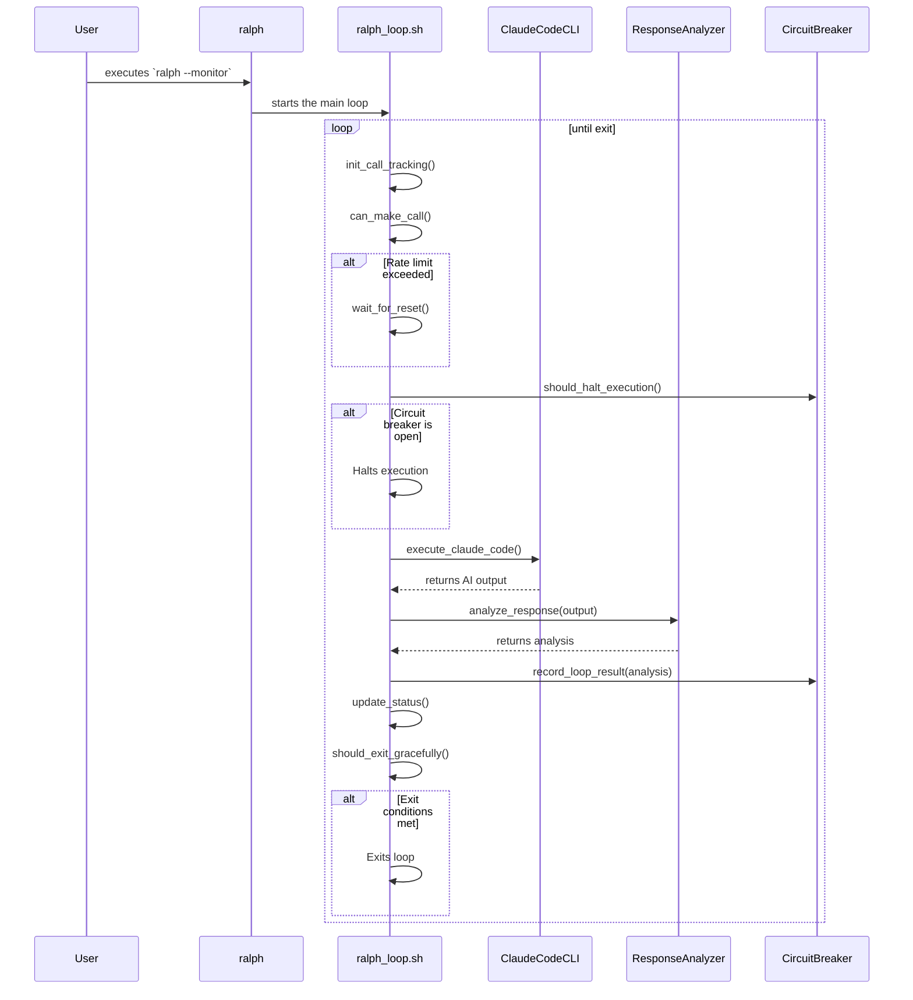
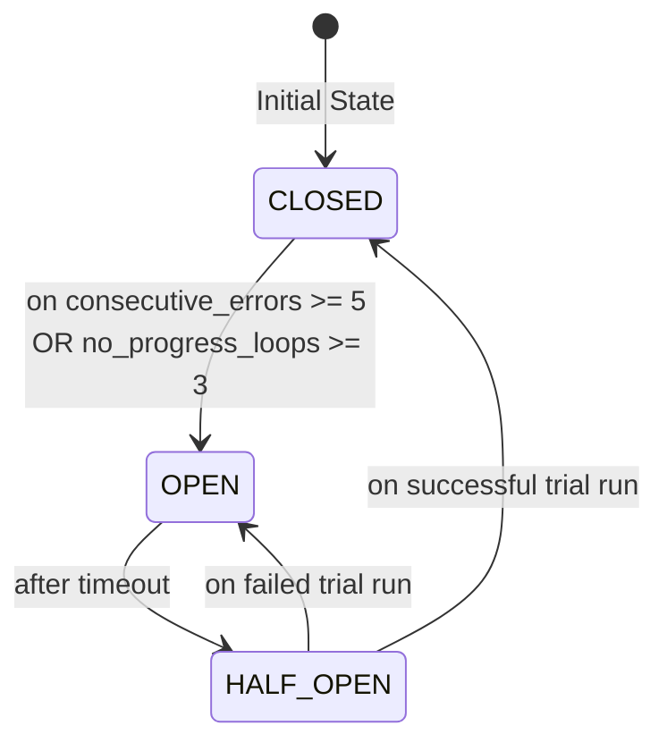

# Detailed Architecture of Ralph for Claude Code

## 1. Introduction

This document provides a detailed, code-level examination of the Ralph for Claude Code tool. It builds on the high-level architecture, diving into specific scripts, functions, and implementation details.

## 2. Core Scripts and Execution Flow

The primary logic of Ralph is contained within a set of shell scripts. The execution flow is orchestrated by the main `ralph` command, which is a wrapper that ultimately calls `ralph_loop.sh`.

### 2.1. `install.sh`

This script is responsible for the one-time installation of Ralph.
-   **Creates Directories:** It creates `~/.ralph` and `~/.local/bin`.
-   **Copies Files:** It copies the core scripts and the `lib/` directory into `~/.ralph`.
-   **Creates Symlinks:** It creates symlinks in `~/.local/bin` to make the `ralph`, `ralph-setup`, and `ralph-monitor` commands globally available.
-   **Dependency Checks:** It verifies that `git`, `jq`, and `tmux` are installed.

### 2.2. `ralph` (Wrapper Script)

This is the main entry point for the user.
-   **Argument Parsing:** It parses command-line arguments like `--monitor`, `--calls`, `--prompt`, etc.
-   **tmux Session Management:** If the `--monitor` flag is used, it calls `setup_tmux_session` to create a new `tmux` session.
-   **Launches Core Loop:** It executes `ralph_loop.sh`, passing along any parsed arguments.

### 2.3. `ralph_loop.sh` (Core Loop)

This is the engine of the autonomous development cycle.

#### Key Functions:

-   `main()`: The main execution block. It initializes the environment, then enters a `while` loop that continues until an exit condition is met.
-   `init_call_tracking()`: Initializes or resets the API call counter and timestamp.
-   `can_make_call()`: Checks if the rate limit has been exceeded.
-   `wait_for_reset()`: If the rate limit is hit, this function pauses execution until the next hour.
-   `execute_claude_code()`: Constructs and executes the command to run the Claude Code CLI.
-   `update_status()`: Writes the current status of the loop (loop count, API calls, etc.) to `logs/status.json`.
-   `should_exit_gracefully()`: Checks for exit conditions and determines if the loop should terminate.

#### Sequence Diagram of a Single Loop Iteration:

## 3. The `lib/` Directory

The `lib/` directory contains modularized shell scripts that provide specific functionalities to the core loop.

### 3.1. `response_analyzer.sh`

This library is responsible for interpreting the output from the Claude Code CLI.

-   `analyze_response()`: The main function. It takes the AI's output as input and performs a series of checks.
-   `detect_completion_signals()`: Looks for keywords and phrases that indicate the AI believes the task is complete.
-   `detect_errors()`: Uses a two-stage process to identify errors. It first looks for common error patterns and then filters out false positives (e.g., the string "error" inside a JSON field).
-   `detect_stuck_loop()`: Compares the errors from the current loop to previous loops to see if the AI is stuck on the same problem.
-   `update_exit_signals()`: Records the findings of the analysis in the `.exit_signals` file.

### 3.2. `circuit_breaker.sh`

This library implements the Circuit Breaker pattern to prevent runaway loops.

-   **States:** The circuit breaker can be in one of three states: `CLOSED` (normal operation), `OPEN` (execution is halted), or `HALF_OPEN` (a trial run is allowed to see if the issue is resolved).
-   `init_circuit_breaker()`: Initializes the state of the circuit breaker.
-   `record_loop_result()`: Takes the analysis from the `response_analyzer` and updates the circuit breaker's internal state. It increments counters for consecutive errors or loops with no progress.
-   `should_halt_execution()`: Checks the current state and determines if the main loop should be halted.

#### State Diagram of the Circuit Breaker:

### 3.3. `date_utils.sh`

This is a utility library that provides cross-platform compatibility for date and time operations, handling the differences between GNU and BSD (macOS) `date` commands.

## 4. Data and State Management

Ralph uses a combination of files in the project directory and the `~/.ralph` directory to manage state.

-   `~/.ralph/.ralph_call_count`: Stores the number of API calls made in the current hour.
-   `~/.ralph/.ralph_timestamp`: Stores the timestamp of the last rate limit reset.
-   `logs/status.json`: A JSON file that contains the current state of the loop. This is read by `ralph-monitor`.
-   `logs/ralph.log`: A detailed log of all operations.
-   `.exit_signals`: A JSON file that stores the signals (completion, errors, etc.) detected by the `response_analyzer`.
-   `@fix_plan.md`: The user-defined list of tasks. The `should_exit_gracefully` function checks this file for completion.

## 5. `ralph-setup` and `ralph-import`

These are project initialization scripts.

-   `ralph-setup`: Creates a new, blank Ralph project with the standard directory structure and template files.
-   `ralph-import`: Takes an existing document (e.g., a PRD in Markdown) and uses Claude Code to convert it into the `PROMPT.md` and `@fix_plan.md` files for a new project. This script is a good example of how Ralph uses AI to bootstrap its own configuration.

## 6. Function-Level Breakdowns

This section provides a more detailed look at the key functions within the core scripts.

### 6.1. `ralph_loop.sh`

-   **`main()`**
    -   **Purpose:** The primary entry point and orchestrator of the autonomous loop.
    -   **Logic:**
        1.  Initializes logging and checks for the existence of `PROMPT.md`.
        2.  Enters an infinite `while true` loop.
        3.  Inside the loop, it increments `loop_count` and calls `init_call_tracking()` to handle the rate limit timer.
        4.  It checks `should_halt_execution()` to see if the circuit breaker is open.
        5.  It checks `can_make_call()` to ensure the rate limit has not been exceeded.
        6.  It calls `should_exit_gracefully()` to check for completion conditions.
        7.  If all checks pass, it calls `execute_claude_code()`.
        8.  It handles the exit code from the execution, pausing or breaking the loop as needed.

-   **`execute_claude_code()`**
    -   **Purpose:** To execute the Claude Code CLI, manage its output, and analyze the results.
    -   **Arguments:** `loop_count`
    -   **Logic:**
        1.  Constructs a command to run the `claude` CLI with a timeout.
        2.  Redirects the output to a timestamped log file in `logs/`.
        3.  While the command runs, it displays a progress indicator.
        4.  On successful execution, it increments the API call counter.
        5.  It then calls `analyze_response()` from the response analyzer library.
        6.  It records the outcome (file changes, errors) with `record_loop_result()` from the circuit breaker library.
    -   **Return Codes:** Returns `0` for success, `1` for a general failure, `2` for hitting the 5-hour API limit, and `3` if the circuit breaker trips.

-   **`should_exit_gracefully()`**
    -   **Purpose:** To determine if the project is complete and the loop should terminate.
    -   **Logic:**
        1.  Reads the `.exit_signals` JSON file.
        2.  Checks for several conditions in order of precedence:
            -   Have there been `>= 3` consecutive test-only loops?
            -   Have there been `>= 2` consecutive "done" signals?
            -   Are all checkboxes in `@fix_plan.md` marked as complete?
        3.  If any condition is met, it returns a string indicating the reason for the exit (e.g., `"test_saturation"`). Otherwise, it returns an empty string.

### 6.2. `lib/response_analyzer.sh`

-   **`analyze_response()`**
    -   **Purpose:** To perform a comprehensive analysis of the AI's output.
    -   **Arguments:** `output_file`, `loop_number`
    -   **Logic:**
        1.  Reads the content of the `output_file`.
        2.  Checks for structured `RALPH_STATUS` output.
        3.  Scans for natural language completion keywords (e.g., "done," "complete").
        4.  Determines if the loop was "test-only" by looking for test commands and a lack of implementation keywords.
        5.  Checks for file changes using `git diff`.
        6.  Calculates a `confidence_score` based on these signals.
        7.  Writes all findings to a `.response_analysis` JSON file.

-   **`update_exit_signals()`**
    -   **Purpose:** To update the persistent state of exit signals based on the latest analysis.
    -   **Logic:**
        1.  Reads the `.response_analysis` and `.exit_signals` files.
        2.  If the analysis indicates a test-only loop, it appends the current loop number to the `test_only_loops` array. If not, it clears the array.
        3.  If the analysis found a completion signal, it appends the loop number to the `done_signals` array.
        4.  It trims the signal arrays to maintain a rolling window of the last 5 loops.
        5.  It overwrites the `.exit_signals` file with the updated JSON.

### 6.3. `lib/circuit_breaker.sh`

-   **`record_loop_result()`**
    -   **Purpose:** To track the health of the development loop and decide if the circuit breaker should change state.
    -   **Arguments:** `loop_number`, `files_changed`, `has_errors`, `output_length`
    -   **Logic:**
        1.  Reads the current state from `.circuit_breaker_state`.
        2.  Determines if progress was made (i.e., if `files_changed > 0`).
        3.  If progress was made, it resets the `consecutive_no_progress` counter. If not, it increments it.
        4.  If `has_errors` is true, it increments the `consecutive_same_error` counter. If not, it resets it.
        5.  It then evaluates the state transition logic:
            -   **From `CLOSED`:** If `consecutive_no_progress >= 3` or `consecutive_same_error >= 5`, move to `OPEN`. If `consecutive_no_progress >= 2`, move to `HALF_OPEN`.
            -   **From `HALF_OPEN`:** If progress is made, move back to `CLOSED`. If not, and the no-progress threshold is met, move to `OPEN`.
        6.  It writes the new state back to the file and logs the transition.

-   **`should_halt_execution()`**
    -   **Purpose:** The main function called by `ralph_loop.sh` to check if the circuit is open.
    -   **Logic:**
        1.  Reads the current state from the `.circuit_breaker_state` file.
        2.  If the state is `OPEN`, it prints a detailed diagnostic message to the user explaining why execution is halted and how to reset the circuit. It then returns `0` (Bash success), which signals to the main loop to halt.
        3.  If the state is not `OPEN`, it returns `1` (Bash failure), signaling that execution can continue.
