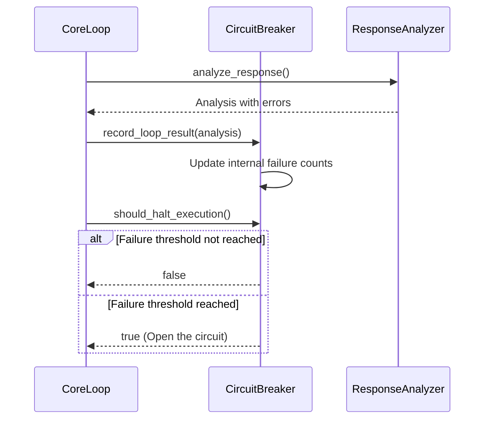
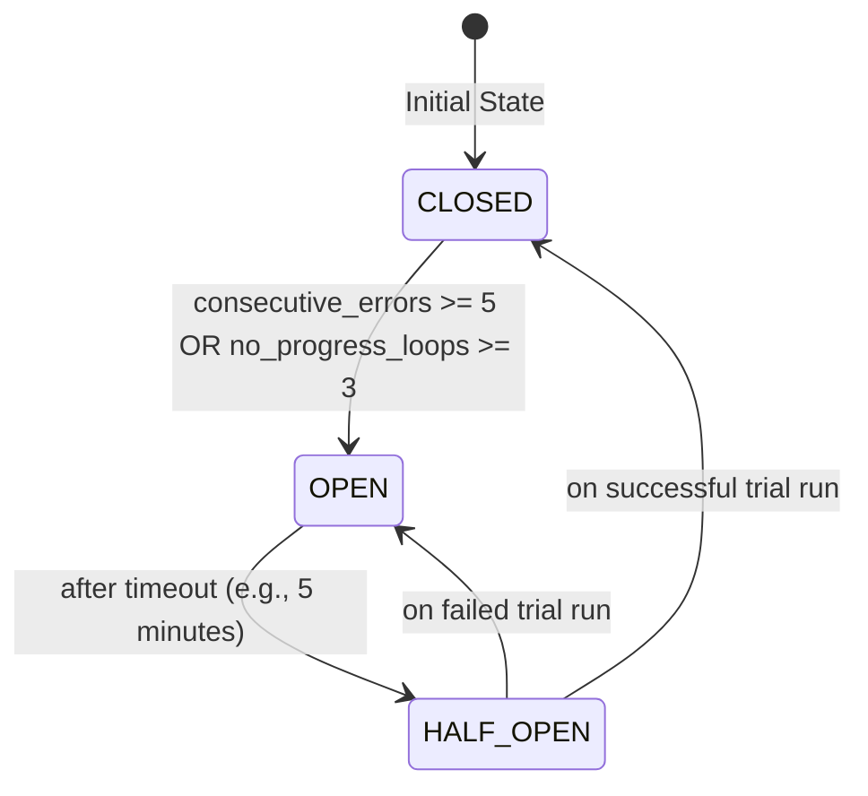

# Diagrams for the Circuit Breaker

This document provides a set of diagrams to visualize the Circuit Breaker feature of the Ralph tool.

## 1. Activity Diagram

This diagram shows the process of recording a loop result and determining whether to halt execution.

```mermaid
graph TD
    A[Loop completes] --> B[record_loop_result()];
    B --> C{Analysis shows error?};
    C -- Yes --> D{Analysis shows no progress?};
    C -- No --> E[Reset failure counters];
    E --> F{Halt execution?};
    D -- Yes --> G[Increment consecutive error and no progress counters];
    D -- No --> H[Increment consecutive error counter];
    G --> F;
    H --> F;
    F -- No --> I[Continue];
    I --> J[End];
    F -- Yes --> K[Halt];
    K --> J;
```

## 2. Sequence Diagram

This diagram shows the interactions that lead to the circuit breaker opening.



## 3. State Diagram

This diagram illustrates the three states of the Circuit Breaker and the transitions between them.


