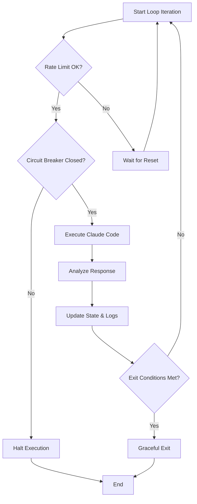
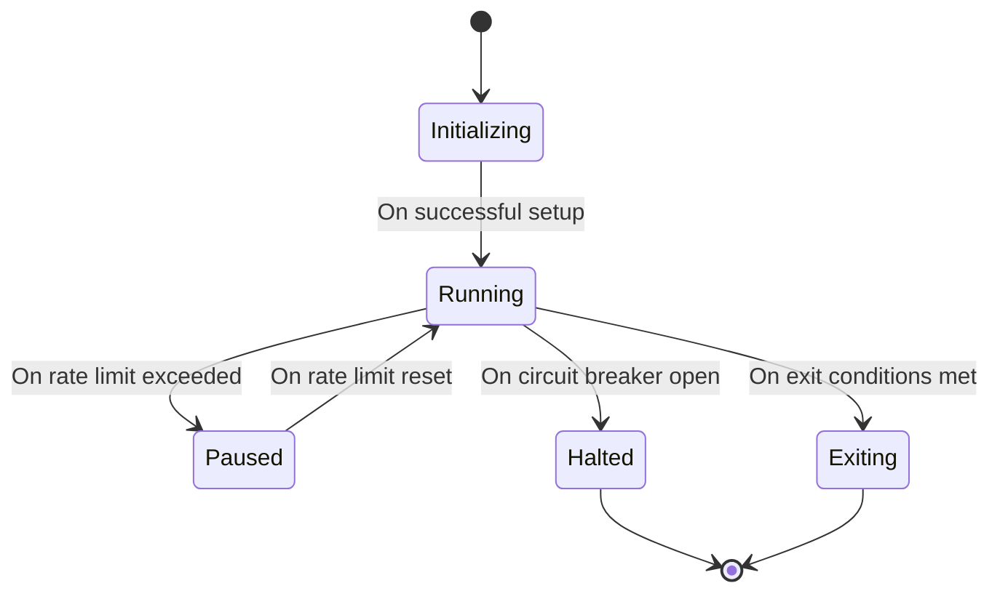

# Diagrams for the Core Autonomous Loop

This document provides a set of diagrams to visualize the Core Autonomous Loop of the Ralph tool from different perspectives.

## 1. Activity Diagram

This diagram shows the flow of activities within a single iteration of the loop.



## 2. Sequence Diagram

This diagram illustrates the interactions between the different components of the system over time during a loop iteration.

```mermaid
sequenceDiagram
    participant Loop as Core Loop
    participant RateLimiter
    participant CircuitBreaker
    participant ClaudeCLI as Claude Code CLI
    participant Analyzer as Response Analyzer

    Loop->>RateLimiter: can_make_call()
    RateLimiter-->>Loop: true
    Loop->>CircuitBreaker: should_halt_execution()
    CircuitBreaker-->>Loop: false
    Loop->>ClaudeCLI: execute()
    ClaudeCLI-->>Loop: AI Output
    Loop->>Analyzer: analyze_response(AI Output)
    Analyzer-->>Loop: Analysis Results
    Loop->>Loop: update_status(Analysis Results)
    Loop->>Loop: check_exit_conditions()
```

## 3. State Diagram

This diagram represents the different states that the Core Loop can be in.


