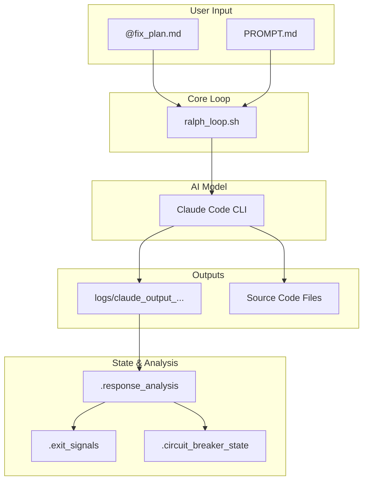

# Data Flow Diagrams

This document provides diagrams to visualize how data flows through the Ralph system during a typical autonomous loop.

## 1. High-Level Data Flow

This diagram shows the flow of the primary data artifacts between the core components of the system.



## 2. Detailed State Management Data Flow

This diagram shows how the key state files are read from and written to by the different components during a single loop iteration.

```mermaid
sequenceDiagram
    participant Loop as ralph_loop.sh
    participant Analyzer as response_analyzer.sh
    participant Breaker as circuit_breaker.sh
    participant Files as State Files

    Loop->>Files: READ .exit_signals
    Note over Loop,Files: should_exit_gracefully()

    Loop->>Files: READ .circuit_breaker_state
    Note over Loop,Files: should_halt_execution()

    Loop->>Analyzer: analyze_response()
    Analyzer->>Files: WRITE .response_analysis

    Analyzer->>Files: READ .response_analysis
    Analyzer->>Files: READ .exit_signals
    Analyzer->>Files: WRITE .exit_signals
    Note over Analyzer,Files: update_exit_signals()

    Loop->>Breaker: record_loop_result()
    Breaker->>Files: READ .circuit_breaker_state
    Breaker->>Files: WRITE .circuit_breaker_state
```
