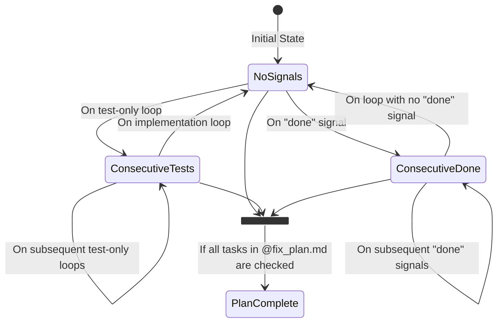

# Diagrams for Intelligent Exit Detection

This document provides a set of diagrams to visualize the Intelligent Exit Detection feature of the Ralph tool from different perspectives.

## 1. Activity Diagram

This diagram shows the flow of logic within the `should_exit_gracefully()` function.

```mermaid
graph TD
    A[Start Check] --> B{Read .exit_signals file};
    B --> C{>= 3 consecutive test loops?};
    C -- Yes --> D[Return "test_saturation"];
    C -- No --> E{>= 2 consecutive done signals?};
    E -- Yes --> F[Return "completion_signals"];
    E -- No --> G{Is @fix_plan.md fully complete?};
    G -- Yes --> H[Return "plan_complete"];
    G -- No --> I[Return ""];
    D --> J[End];
    F --> J;
    H --> J;
    I --> J;
```

## 2. Sequence Diagram

This diagram illustrates how the core loop interacts with the state files to determine if it should exit.

```mermaid
sequenceDiagram
    participant Loop as ralph_loop.sh
    participant Analyzer as response_analyzer.sh
    participant State as .exit_signals & @fix_plan.md

    loop A loop iteration
        Loop->>Analyzer: analyze_response()
        Analyzer->>State: WRITE updated .exit_signals
    end

    Loop->>State: READ .exit_signals
    Loop->>State: READ @fix_plan.md
    Note over Loop,State: Checks for exit conditions
    Loop-->>Loop: Decides whether to exit
```

## 3. State Diagram

This diagram represents the states of the `exit_signals` tracker, which is a key input to the exit detection logic.


