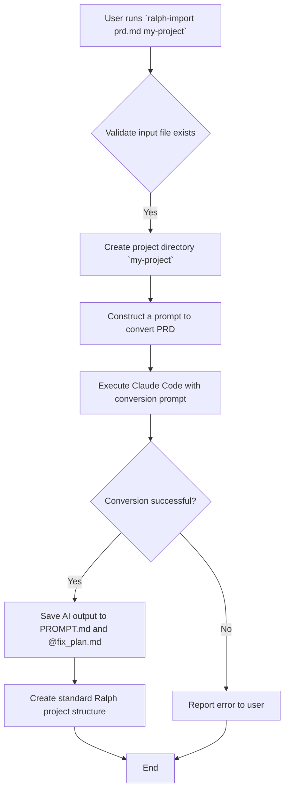
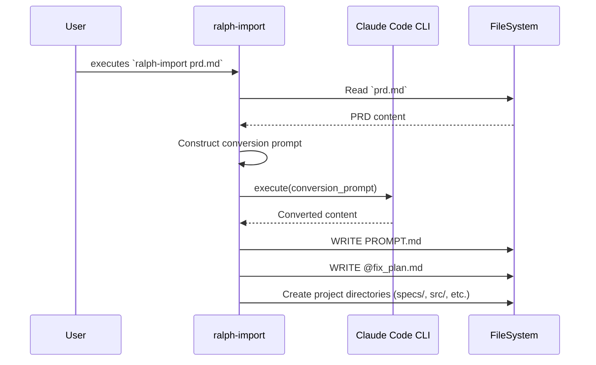

# Diagrams for PRD Import Feature

This document provides a set of diagrams to visualize the PRD (Product Requirement Document) Import feature of the Ralph tool.

## 1. Activity Diagram

This diagram shows the flow of activities when the `ralph-import` command is executed.



## 2. Sequence Diagram

This diagram illustrates the interactions between the user, the import script, and the Claude Code CLI.



## 3. Data Flow Diagram

This diagram focuses on how the data is transformed from the initial PRD to the final Ralph project files.

```mermaid
graph TD
    A[Input PRD (.md, .txt, etc.)] --> B[ralph-import script];
    B -- "sends as context in a prompt" --> C[Claude Code CLI];
    C -- "returns structured text" --> D{AI-Generated Content};
    D -- "instructions part" --> E["PROMPT.md"];
    D -- "task list part" --> F["@fix_plan.md"];
    B -- "creates" --> G["Standard Directories (src/, specs/, etc.)"];
```
