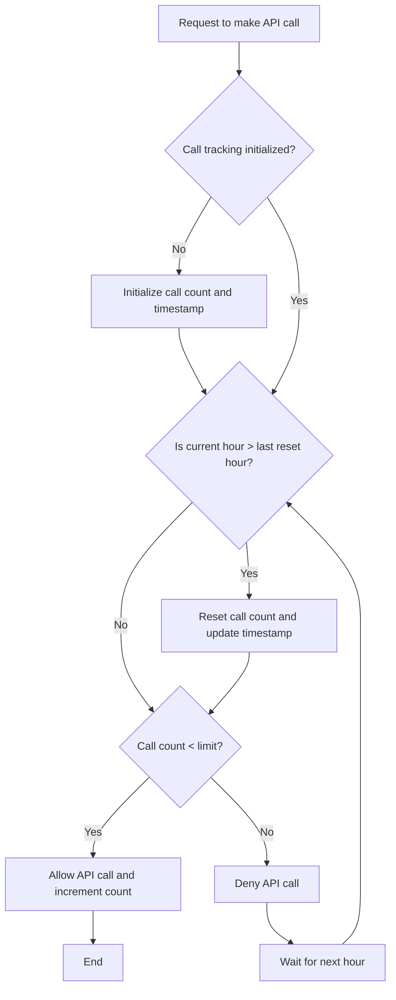
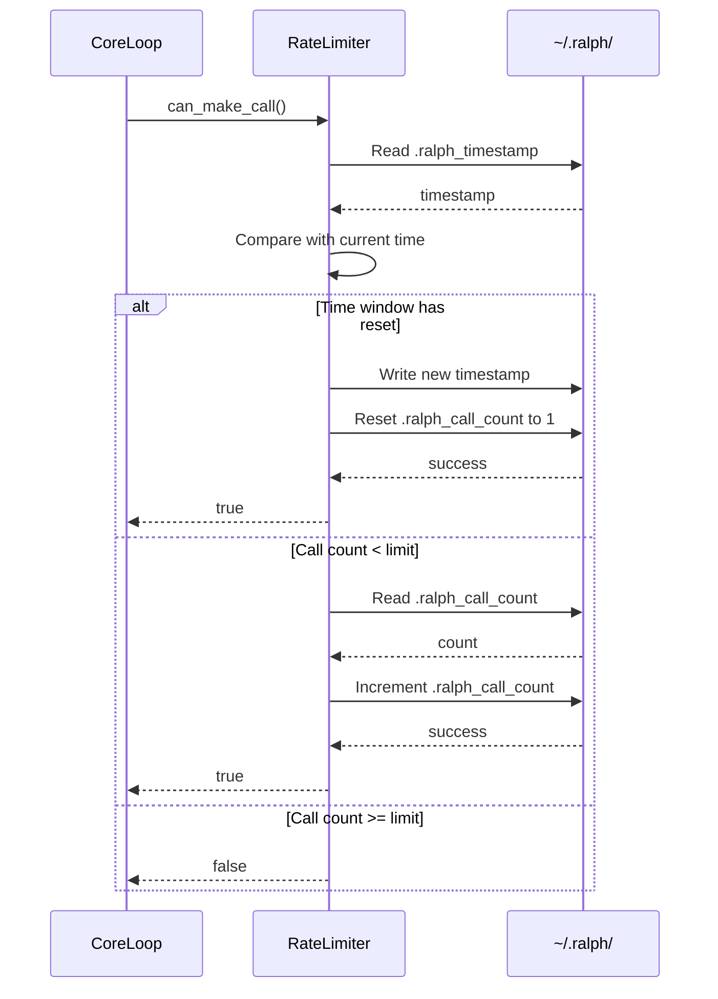
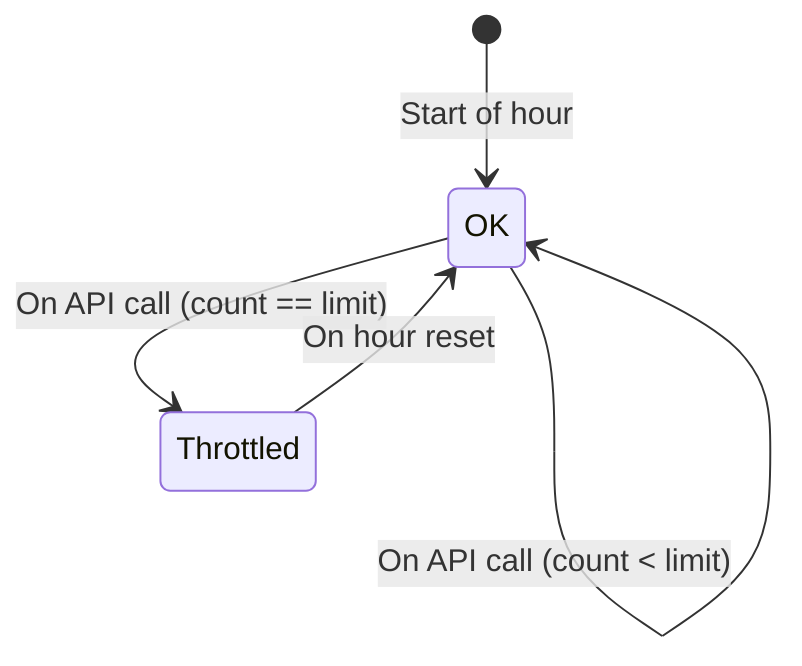

# Diagrams for the Rate Limiter

This document provides a set of diagrams to visualize the Rate Limiter feature of the Ralph tool.

## 1. Activity Diagram

This diagram shows the logic flow when a request to make an API call is handled.

## 2. Sequence Diagram

This diagram shows the interactions when the core loop checks the rate limiter.

## 3. State Diagram

This diagram represents the states of the Rate Limiter within an hourly window.

