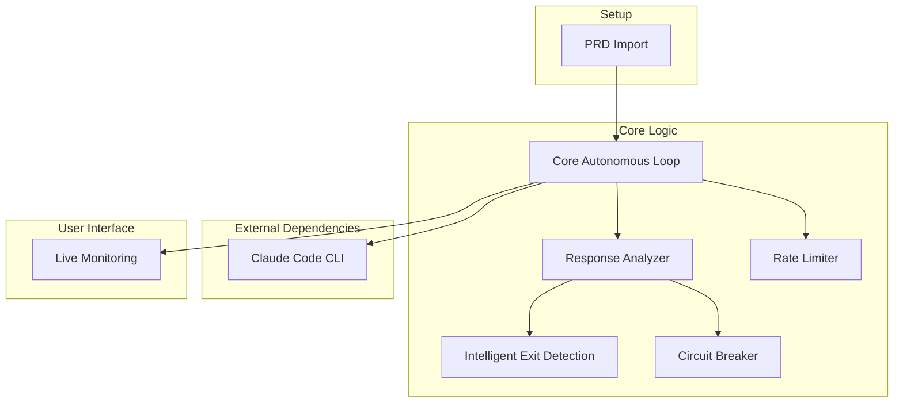
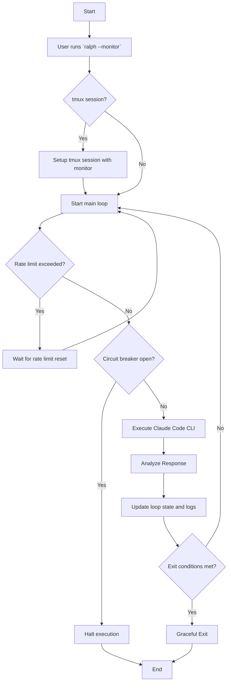

# High-Level Architecture of Ralph for Claude Code

## 1. Introduction

Ralph is an autonomous AI development tool designed to create a continuous development loop. It leverages an AI code assistant (Claude Code) to iteratively work on a project until it meets a set of predefined completion criteria. This document provides a high-level overview of Ralph's architecture, its core components, and how they interact.

## 2. Core Components

The system is composed of several key components that work together to provide the autonomous development loop.

### 2.1. Core Autonomous Loop

This is the heart of Ralph. It is a shell script (`ralph_loop.sh`) that continuously executes the following steps:
1.  Reads project requirements from `PROMPT.md` and `@fix_plan.md`.
2.  Executes the Claude Code CLI with the current context.
3.  Logs the results of the execution.
4.  Evaluates the output to determine the next step.
5.  Repeats the cycle until an exit condition is met.

### 2.2. Response Analyzer

The Response Analyzer (`lib/response_analyzer.sh`) is a sophisticated component that examines the output from the Claude Code CLI. Its primary responsibilities are:
-   **Semantic Understanding:** It interprets the AI's output to identify signals of progress, completion, or errors.
-   **Error Filtering:** It uses a two-stage filtering process to accurately detect genuine errors and avoid false positives.
-   **Stuck Loop Detection:** It identifies when the AI is stuck in a repetitive error loop.

### 2.3. Intelligent Exit Detection

This component determines when the autonomous loop should stop. It aggregates signals from the Response Analyzer and checks for several conditions:
-   All tasks in `@fix_plan.md` are marked as complete.
-   Multiple consecutive "done" or "completion" signals from the AI.
-   A high percentage of test-focused loops, indicating that feature development is likely complete.
-   The Claude API's 5-hour usage limit is reached.

### 2.4. Rate Limiter

The Rate Limiter prevents excessive API usage. It tracks the number of calls made to the Claude Code CLI within a specific time window (e.g., 100 calls per hour). If the limit is reached, it will pause execution until the window resets.

### 2.5. Circuit Breaker

The Circuit Breaker (`lib/circuit_breaker.sh`) is a safety mechanism that prevents runaway loops. It monitors the state of the development loop and will "open" (halt execution) if it detects:
-   Multiple consecutive loops with no file changes.
-   The same error repeating across multiple loops.
-   A significant decline in the quality or length of the AI's output.

### 2.6. Live Monitoring

Ralph integrates with `tmux` to provide a live monitoring dashboard. This allows the user to observe the status of the loop, view logs in real-time, and see the current API call count.

### 2.7. PRD Import

The `ralph-import` command is a setup utility that converts existing Product Requirement Documents (PRDs) or other specification files into the format that Ralph uses (`PROMPT.md`, `@fix_plan.md`, etc.).

## 3. High-Level Process Flow

The following diagram illustrates the typical workflow when a user runs the `ralph` command.

